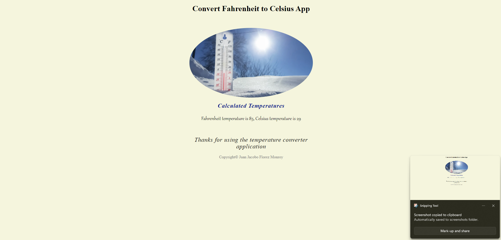
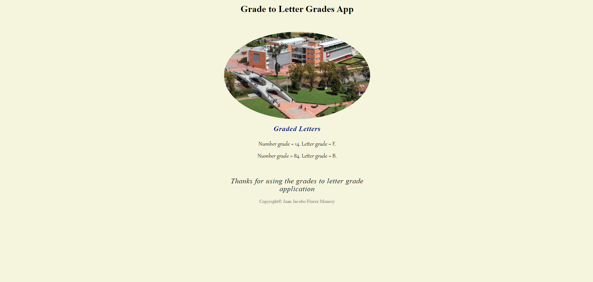
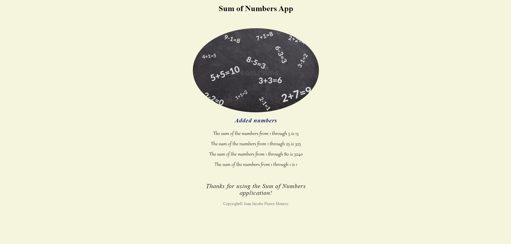

# 🖥️ JavaScript Assignment

## 📌 Project Overview
This project consists of three interactive JavaScript applications, each designed to perform a different task:

- **🔥 Convert Temps**: Converts temperatures from Fahrenheit to Celsius.
- **🎓 Letter Grade**: Converts numeric grades into letter grades based on a predefined scale.
- **➕ Sum Numbers**: Calculates the sum of numbers from 1 to a user-defined number.

This project was developed as part of a college assignment.

---

## 🚀 Features
👉 **Temperature Converter**: Users enter a Fahrenheit value, and it is converted to Celsius.  
👉 **Grade Converter**: Users input a numeric grade (0-100) and receive the equivalent letter grade.  
👉 **Sum Calculator**: Users enter a number, and the app calculates the sum of all integers up to that number.  
👉 **📢 Interactive Alerts & Prompts**: Uses `prompt()` and `alert()` for user interaction.  
👉 **🎨 Simple & Clean UI**: Styled with CSS for a minimalistic design.  

---

## 🎯 Project Purpose
This project was created as part of a college assignment, allowing me to practice:
- **JavaScript input handling** (`prompt()`, `alert()`).
- **Conditional statements and loops**.
- **Basic calculations and data validation**.
- **Integration of JavaScript with HTML and CSS**.

---

## 📚 Project Structure

```
💁 javascript_assignment
 ├── 📁 css/                # Stylesheets
 │   ├── main.css          # Main CSS file
 ├── 📁 img/github/         # Image assets (screenshots)
 ├── 📄 convert_temps.html  # Fahrenheit to Celsius converter
 ├── 📄 letter_grade.html   # Numeric to letter grade converter
 └── 📄 sum_numbers.html    # Sum calculator
```

---

## 🛠 Technologies Used
- **HTML5**: Webpage structure.  
- **CSS3**: Styling and layout.  
- **JavaScript (ES6+)**: Interactive functionalities.  

---

## 📌 Prerequisites
To run the project, ensure you have:
- A modern web browser (Chrome, Firefox, Edge, etc.).

---

## 🏃‍♂️ How to Use

1️⃣ Open the corresponding `.html` file in a web browser.  
2️⃣ Follow the on-screen prompts to enter data.  
3️⃣ View the results displayed in alerts or directly on the page.  

---

## 🖼️ Screenshots

| Convert Temps | Letter Grade | Sum Numbers |
|--------------|--------------|------------|
|  |  |  |

---

## 📝 License
This project was developed for educational purposes as part of a college assignment.

---

## 💼 Author

👤 **Juan Jacobo Florez Monroy**  
🌐 **Portfolio**: [jjacobo95.com](https://jjacobo95.com)  
🐙 **GitHub**: [github.com/jjacoboflorez95](https://github.com/jjacoboflorez95)